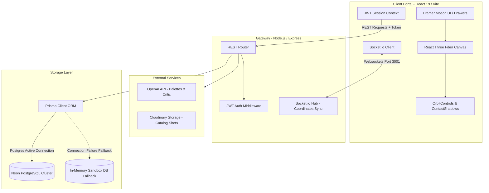
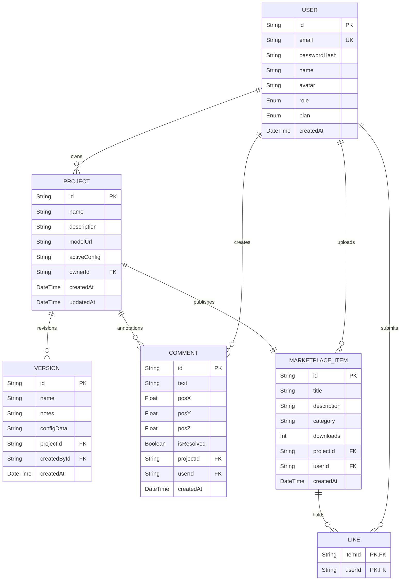

# ProductVerse AI - Enterprise Product Experience Platform (PXP)

ProductVerse AI is an enterprise-grade 3D Product Experience Platform that empowers luxury automotive, consumer products, apparel, and design teams to configure, collaborate on, and simulate complex products in high-fidelity 3D. 

Powered by **React 19**, **Three.js**, **React Three Fiber (R3F)**, **Socket.IO**, and **OpenAI APIs**, the platform bridges the gap between engineering CAD blueprints, real-time creative collaboration, and AI-assisted material styling.

---

## 1. System Architecture



---

## 2. Database ER Diagram



---

## 3. Local Installation & Startup Guide

Follow these steps to configure, build, and run the client and server locally:

### Prerequisites
* **Node.js**: v18.0.0 or higher
* **NPM**: v9.0.0 or higher

### Phase 1: Clone and Install Dependencies
Install all package configurations for both client and backend:
```bash
# Clone the repository
cd productverse-ai

# Install backend dependencies
cd server
npm install --strict-ssl=false

# Install frontend dependencies
cd ../client
npm install --strict-ssl=false
```

### Phase 2: Setup Environment Templates
Copy the templates to `.env` files in both directories:
```bash
# Inside client directory
cp .env.example .env

# Inside server directory
cd ../server
cp .env.example .env
```
Ensure your database connection string and API key settings are updated.

### Phase 3: Start Development Servers
Start both modules in parallel:
```bash
# Run server (runs on Port 3001)
cd server
npm run dev

# Run client (runs on Port 3000)
cd client
npm run dev
```
Open `http://localhost:3000` to interact with the platform.

---

## 4. Production Deployment Guide

ProductVerse AI is structured for easy deployment to cloud services:

### A. Frontend Deployment (Vercel)
1. **Initialize Project**: Connect your GitHub repository to Vercel.
2. **Framework Preset**: Select **Vite**.
3. **Build Command**: `npm run build`
4. **Output Directory**: `dist`
5. **Environment Variables**:
   * Add `VITE_API_URL` pointing to your Railway backend domain (e.g., `https://productverse-backend.up.railway.app`).
   * Add `VITE_WS_URL` with the same URL values.

### B. Backend Deployment (Railway)
1. **Deploy Service**: Link your server repository root or directory inside Railway.
2. **Build Tooling**: Railway automatically detects configuration files and compiles using the Nixpacks builder.
3. **Environment Settings**: Configure the following variables in the dashboard:
   * `PORT`: `3001`
   * `NODE_ENV`: `production`
   * `JWT_SECRET`: A secure random passphrase.
   * `DATABASE_URL`: Connection string to your PostgreSQL database.
   * `OPENAI_API_KEY`: Your OpenAI organization key.
   * `CLOUDINARY_URL`: Cloudinary storage URL.

### C. Database (Neon Serverless PostgreSQL)
1. Register a free PostgreSQL database instance at [Neon](https://neon.tech).
2. Copy the PostgreSQL connection URI from the console.
3. Update the `DATABASE_URL` parameter in your Railway application environment settings.
4. Run migrations remotely to populate tables:
   ```bash
   npx prisma db push
   ```

### D. File Storage (Cloudinary)
1. Register an account at [Cloudinary](https://cloudinary.com).
2. Retrieve your `CLOUDINARY_URL` key string from your cloud account.
3. Save it to your server configuration. This enables high-performance upload of photographed product canvas exports directly to CDN assets.
